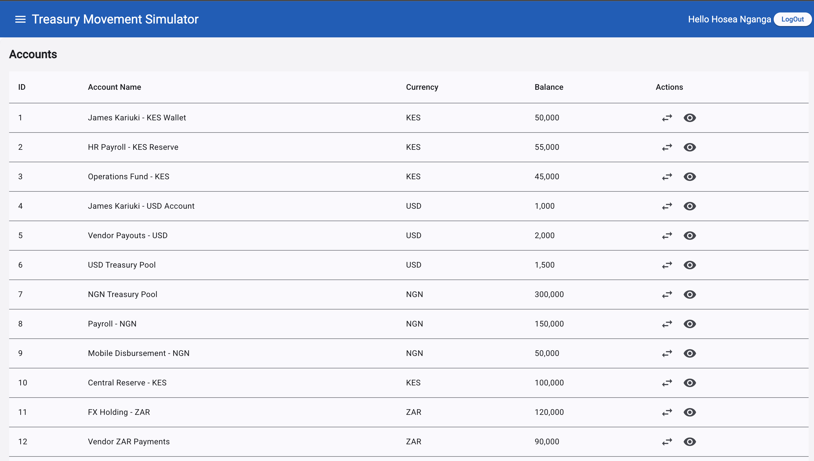
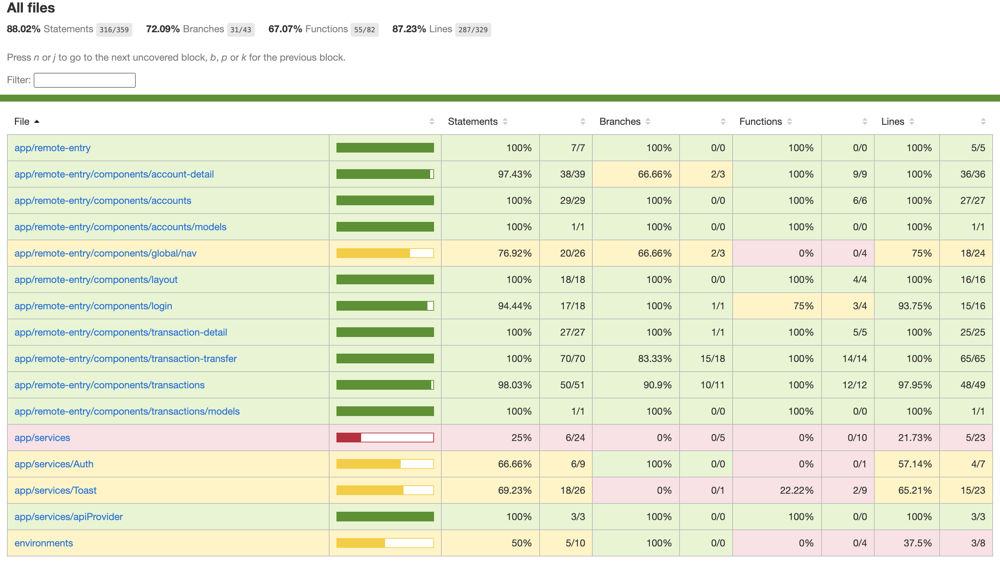

<h2>Screenshots of the Project 📸</h2>
<br>

<div align='center'>


</div>
<div align='center'>

</div>

# Treasury Movement Simulator(Angular)

This application simulates core treasury and operations workflows for a B2B fintech platform. It is built to help finance teams manage internal account balances, transfer funds across multiple currencies, schedule future transactions, and track transaction history.

---

## Technologies used

- Technologies used
  - [Angular](https://angular.dev/overview) - A typescript based framework for web development
  - [SCSS](https://sass-lang.com/documentation/) - A stylesheet language that’s compiled to CSS.
  - [Typescript](https://www.typescriptlang.org/) - Strongly typed language for safe incontractly to using Javasript
  - [Jest](https://jestjs.io/)- A delightful JavaScript Testing Framework with a focus on simplicity.
  - [TestBed](https://angular.dev/api/core/testing/TestBed)- Configures and initializes environment for unit testing and provides methods for creating components and services in unit tests.
  - [Github-Actions](https://github.com/features/actions)-  (CI/CD) platform that allows you to automate your   build, test, and deployment pipeline
  - [Firebase Hosting](https://firebase.google.com/)-A fast and secure web hosting platform provided by Google for deploying web apps.

## 🚀 Features  

- **Lazy Loading**  
  Implements Angular's lazy loading for modules and components to reduce initial load times and improve performance by loading only the necessary resources on demand.

- **Dynamic UI Components**  
 Utilizes ngx-bootstrap and ngx-ui libraries to deliver reusable, responsive, and visually appealing UI elements such as modals, carousels, and tooltips.

  - **Routing Optimization**  
  Employs Angular Router with lazy-loaded routes to ensure fast navigation and efficient resource management.

- **Real-Time Search**  
  Integrates a search functionality which filter transactions by account or currency in real-time.

- ⚡ **Responsive Design**  
  Built with Tailwind and custom SCSS to ensure compatibility across devices, from mobile to desktop.

- 🎯 **Performance Enhancements**  
  - Ahead-of-Time (AOT) Compilation: Reduces bundle size and improves rendering speed.
  - Tree Shaking: Eliminates unused code to optimize the application bundle.
  - Change Detection Optimization: Leverages OnPush change detection strategy to minimize unnecessary DOM updates.

- 💫 **Custom Backend Integration**  
  A backend that exposes routes for /accounts, /accounts/:id, /transactions, /transactions/:id, /transactions/scheduled, and fund transfer logic.
  A dedicated backend service dynamically sets environment variables (ie.API SECRETS) during application initialization for secure and flexible configuration.

---

## 🛠 Tech Stack

- **Framework**: Angular
- **State & Events**: RxJS, Observables
- **Animations**: Angular Animations API
- **HTTP**: Angular HttpClient
- **UI**: SCSS + Angular Component Styling
- **API**: [Custom Node/js & Typescript]

---

## Test


<br/>

This project uses Jest (instead of Karma) for unit testing in Angular. One of the core challenges I faced was enabling flexible test execution—being able to run tests individually during development and also support full test suite runs for CI/CD pipelines. To achieve that flexibility, I introduced an environment-aware setup in jest.config.js.

### 🧪 How to Use

- npm run test – Run selected or focused tests.

- npm run test:all – Execute the complete suite.

## Github Action (CI/CD)

Automate project build, test, and deployment pipeline


## 📦 Getting Started

First, run the development server:

1. Clone the project

```bash
git clone https://github.com/HoseaNganga/Treasury-Movement-Simulator.git
```

2. Install dependecies

```bash
npm install
```

3. Change directory

```bash
 cd treasury-movement-simulator
```

4. Run the application

```bash
ng serve
```

Open [http://localhost:4200](http://localhost:4200) with your browser to see the result.

## Contributing

Contributions are welcome! If you'd like to contribute to this project, please fork the repository and submit a pull request with your changes.

## License

This project is licensed under the MIT License - see the [LICENSE](./LICENSE) file for details.
